    作者: 李利威
    出版社: 机械工业出版社
    出版年: 2019-5-1
    页数: 396
    定价: 79.00元
    装帧: 平装
    ISBN: 9787111623687

[豆瓣链接](https://book.douban.com/subject/33413106/)

- [第一部分 顶层架构](#%e7%ac%ac%e4%b8%80%e9%83%a8%e5%88%86-%e9%a1%b6%e5%b1%82%e6%9e%b6%e6%9e%84)
  - [第1章 解码24个核心持股比](#%e7%ac%ac1%e7%ab%a0-%e8%a7%a3%e7%a0%8124%e4%b8%aa%e6%a0%b8%e5%bf%83%e6%8c%81%e8%82%a1%e6%af%94)
    - [1.1 有限公司](#11-%e6%9c%89%e9%99%90%e5%85%ac%e5%8f%b8)
    - [1.2 非公众股份公司](#12-%e9%9d%9e%e5%85%ac%e4%bc%97%e8%82%a1%e4%bb%bd%e5%85%ac%e5%8f%b8)
    - [1.3 新三板公司](#13-%e6%96%b0%e4%b8%89%e6%9d%bf%e5%85%ac%e5%8f%b8)
    - [1.4 上市公司](#14-%e4%b8%8a%e5%b8%82%e5%85%ac%e5%8f%b8)
  - [第2章 分股不分权的7种方法](#%e7%ac%ac2%e7%ab%a0-%e5%88%86%e8%82%a1%e4%b8%8d%e5%88%86%e6%9d%83%e7%9a%847%e7%a7%8d%e6%96%b9%e6%b3%95)
    - [2.1 有限合伙企业](#21-%e6%9c%89%e9%99%90%e5%90%88%e4%bc%99%e4%bc%81%e4%b8%9a)
      - [2.1.1 有限合伙企业简介](#211-%e6%9c%89%e9%99%90%e5%90%88%e4%bc%99%e4%bc%81%e4%b8%9a%e7%ae%80%e4%bb%8b)
      - [2.1.2 案例1 海康威视](#212-%e6%a1%88%e4%be%8b1-%e6%b5%b7%e5%ba%b7%e5%a8%81%e8%a7%86)
        - [1.上市前股权架构](#1%e4%b8%8a%e5%b8%82%e5%89%8d%e8%82%a1%e6%9d%83%e6%9e%b6%e6%9e%84)
        - [2.痛不欲生的减持](#2%e7%97%9b%e4%b8%8d%e6%ac%b2%e7%94%9f%e7%9a%84%e5%87%8f%e6%8c%81)
        - [3.最终的解决之道](#3%e6%9c%80%e7%bb%88%e7%9a%84%e8%a7%a3%e5%86%b3%e4%b9%8b%e9%81%93)
      - [2.1.3 有限合伙企业妙用](#213-%e6%9c%89%e9%99%90%e5%90%88%e4%bc%99%e4%bc%81%e4%b8%9a%e5%a6%99%e7%94%a8)
        - [1.纳税上的节税效应](#1%e7%ba%b3%e7%a8%8e%e4%b8%8a%e7%9a%84%e8%8a%82%e7%a8%8e%e6%95%88%e5%ba%94)
        - [2.治理结构钱权分离](#2%e6%b2%bb%e7%90%86%e7%bb%93%e6%9e%84%e9%92%b1%e6%9d%83%e5%88%86%e7%a6%bb)
    - [2.2 金字塔架构](#22-%e9%87%91%e5%ad%97%e5%a1%94%e6%9e%b6%e6%9e%84)
      - [2.2.1 金字塔架构简介](#221-%e9%87%91%e5%ad%97%e5%a1%94%e6%9e%b6%e6%9e%84%e7%ae%80%e4%bb%8b)
      - [2.2.2 金字塔架构启发](#222-%e9%87%91%e5%ad%97%e5%a1%94%e6%9e%b6%e6%9e%84%e5%90%af%e5%8f%91)
        - [1.股权杠杆以小博大](#1%e8%82%a1%e6%9d%83%e6%9d%a0%e6%9d%86%e4%bb%a5%e5%b0%8f%e5%8d%9a%e5%a4%a7)
        - [2.纳税筹划效应](#2%e7%ba%b3%e7%a8%8e%e7%ad%b9%e5%88%92%e6%95%88%e5%ba%94)
        - [3.便利债权融资](#3%e4%be%bf%e5%88%a9%e5%80%ba%e6%9d%83%e8%9e%8d%e8%b5%84)
        - [4.方便人事安排](#4%e6%96%b9%e4%be%bf%e4%ba%ba%e4%ba%8b%e5%ae%89%e6%8e%92)
        - [5.控股公司单独上市](#5%e6%8e%a7%e8%82%a1%e5%85%ac%e5%8f%b8%e5%8d%95%e7%8b%ac%e4%b8%8a%e5%b8%82)
        - [6.上市后的市值管理](#6%e4%b8%8a%e5%b8%82%e5%90%8e%e7%9a%84%e5%b8%82%e5%80%bc%e7%ae%a1%e7%90%86)
      - [2.2.3 两种股权架构比较](#223-%e4%b8%a4%e7%a7%8d%e8%82%a1%e6%9d%83%e6%9e%b6%e6%9e%84%e6%af%94%e8%be%83)
        - [1.税负的差异](#1%e7%a8%8e%e8%b4%9f%e7%9a%84%e5%b7%ae%e5%bc%82)
        - [2.机制的弹性](#2%e6%9c%ba%e5%88%b6%e7%9a%84%e5%bc%b9%e6%80%a7)
    - [2.3 一致行动人](#23-%e4%b8%80%e8%87%b4%e8%a1%8c%e5%8a%a8%e4%ba%ba)
      - [2.3.1 一致行动人的概念](#231-%e4%b8%80%e8%87%b4%e8%a1%8c%e5%8a%a8%e4%ba%ba%e7%9a%84%e6%a6%82%e5%bf%b5)
      - [2.3.3 一致行动人点评](#233-%e4%b8%80%e8%87%b4%e8%a1%8c%e5%8a%a8%e4%ba%ba%e7%82%b9%e8%af%84)
      - [2.3.4 一致行动人协议](#234-%e4%b8%80%e8%87%b4%e8%a1%8c%e5%8a%a8%e4%ba%ba%e5%8d%8f%e8%ae%ae)
    - [2.4 委托投票权](#24-%e5%a7%94%e6%89%98%e6%8a%95%e7%a5%a8%e6%9d%83)
      - [2.4.1 委托投票权的定义](#241-%e5%a7%94%e6%89%98%e6%8a%95%e7%a5%a8%e6%9d%83%e7%9a%84%e5%ae%9a%e4%b9%89)
      - [2.4.3 委托投票权点评](#243-%e5%a7%94%e6%89%98%e6%8a%95%e7%a5%a8%e6%9d%83%e7%82%b9%e8%af%84)
    - [2.5 公司章程控制](#25-%e5%85%ac%e5%8f%b8%e7%ab%a0%e7%a8%8b%e6%8e%a7%e5%88%b6)
      - [2.5.2 公司章程要点](#252-%e5%85%ac%e5%8f%b8%e7%ab%a0%e7%a8%8b%e8%a6%81%e7%82%b9)
        - [1.有限公司](#1%e6%9c%89%e9%99%90%e5%85%ac%e5%8f%b8)
        - [2.股份公司](#2%e8%82%a1%e4%bb%bd%e5%85%ac%e5%8f%b8)
    - [2.6 优先股](#26-%e4%bc%98%e5%85%88%e8%82%a1)
      - [2.6.1 优先股的含义](#261-%e4%bc%98%e5%85%88%e8%82%a1%e7%9a%84%e5%90%ab%e4%b9%89)
      - [2.6.2 案例5 中导光电](#262-%e6%a1%88%e4%be%8b5-%e4%b8%ad%e5%af%bc%e5%85%89%e7%94%b5)
        - [1.优先获得固定股息](#1%e4%bc%98%e5%85%88%e8%8e%b7%e5%be%97%e5%9b%ba%e5%ae%9a%e8%82%a1%e6%81%af)
        - [2.回售权](#2%e5%9b%9e%e5%94%ae%e6%9d%83)
      - [2.6.3 优先股点评](#263-%e4%bc%98%e5%85%88%e8%82%a1%e7%82%b9%e8%af%84)
    - [2.7 AB股](#27-ab%e8%82%a1)
      - [2.7.1 AB股的概念](#271-ab%e8%82%a1%e7%9a%84%e6%a6%82%e5%bf%b5)
      - [2.7.2 案例6 小米集团](#272-%e6%a1%88%e4%be%8b6-%e5%b0%8f%e7%b1%b3%e9%9b%86%e5%9b%a2)
        - [1.AB股架构](#1ab%e8%82%a1%e6%9e%b6%e6%9e%84)
        - [2.优先股架构](#2%e4%bc%98%e5%85%88%e8%82%a1%e6%9e%b6%e6%9e%84)
        - [3.委托投票权](#3%e5%a7%94%e6%89%98%e6%8a%95%e7%a5%a8%e6%9d%83)
        - [4.公司章程约定](#4%e5%85%ac%e5%8f%b8%e7%ab%a0%e7%a8%8b%e7%ba%a6%e5%ae%9a)
  - [第3章 分股的“道”和“术”](#%e7%ac%ac3%e7%ab%a0-%e5%88%86%e8%82%a1%e7%9a%84%e9%81%93%e5%92%8c%e6%9c%af)
    - [3.1 分股之道](#31-%e5%88%86%e8%82%a1%e4%b9%8b%e9%81%93)
      - [3.1.3 驭人性：案例9 真功夫](#313-%e9%a9%ad%e4%ba%ba%e6%80%a7%e6%a1%88%e4%be%8b9-%e7%9c%9f%e5%8a%9f%e5%a4%ab)
    - [3.2 分股之术](#32-%e5%88%86%e8%82%a1%e4%b9%8b%e6%9c%af)
      - [3.2.1 vesting制度](#321-vesting%e5%88%b6%e5%ba%a6)
        - [1.vesting制度介绍](#1vesting%e5%88%b6%e5%ba%a6%e4%bb%8b%e7%bb%8d)
        - [2.vesting的实操](#2vesting%e7%9a%84%e5%ae%9e%e6%93%8d)
- [第二部分 主体架构](#%e7%ac%ac%e4%ba%8c%e9%83%a8%e5%88%86-%e4%b8%bb%e4%bd%93%e6%9e%b6%e6%9e%84)
  - [第4章 有限合伙架构](#%e7%ac%ac4%e7%ab%a0-%e6%9c%89%e9%99%90%e5%90%88%e4%bc%99%e6%9e%b6%e6%9e%84)
    - [4.1 有限合伙架构简介](#41-%e6%9c%89%e9%99%90%e5%90%88%e4%bc%99%e6%9e%b6%e6%9e%84%e7%ae%80%e4%bb%8b)
    - [4.2 案例10 蚂蚁金服](#42-%e6%a1%88%e4%be%8b10-%e8%9a%82%e8%9a%81%e9%87%91%e6%9c%8d)
    - [4.3 有限合伙架构实操要点](#43-%e6%9c%89%e9%99%90%e5%90%88%e4%bc%99%e6%9e%b6%e6%9e%84%e5%ae%9e%e6%93%8d%e8%a6%81%e7%82%b9)
      - [4.3.1 合伙企业的税收陷阱](#431-%e5%90%88%e4%bc%99%e4%bc%81%e4%b8%9a%e7%9a%84%e7%a8%8e%e6%94%b6%e9%99%b7%e9%98%b1)
      - [4.3.2 合伙企业注册地陷阱](#432-%e5%90%88%e4%bc%99%e4%bc%81%e4%b8%9a%e6%b3%a8%e5%86%8c%e5%9c%b0%e9%99%b7%e9%98%b1)
    - [4.4 有限合伙架构适用情形](#44-%e6%9c%89%e9%99%90%e5%90%88%e4%bc%99%e6%9e%b6%e6%9e%84%e9%80%82%e7%94%a8%e6%83%85%e5%bd%a2)
      - [4.4.1 钱权分离度极高的创始人股东](#441-%e9%92%b1%e6%9d%83%e5%88%86%e7%a6%bb%e5%ba%a6%e6%9e%81%e9%ab%98%e7%9a%84%e5%88%9b%e5%a7%8b%e4%ba%ba%e8%82%a1%e4%b8%9c)
      - [4.4.2 有短期套现意图的财务投资人](#442-%e6%9c%89%e7%9f%ad%e6%9c%9f%e5%a5%97%e7%8e%b0%e6%84%8f%e5%9b%be%e7%9a%84%e8%b4%a2%e5%8a%a1%e6%8a%95%e8%b5%84%e4%ba%ba)
      - [4.4.3 员工持股平台](#443-%e5%91%98%e5%b7%a5%e6%8c%81%e8%82%a1%e5%b9%b3%e5%8f%b0)
  - [第5章 自然人直接架构](#%e7%ac%ac5%e7%ab%a0-%e8%87%aa%e7%84%b6%e4%ba%ba%e7%9b%b4%e6%8e%a5%e6%9e%b6%e6%9e%84)
    - [5.1 自然人直接架构简介](#51-%e8%87%aa%e7%84%b6%e4%ba%ba%e7%9b%b4%e6%8e%a5%e6%9e%b6%e6%9e%84%e7%ae%80%e4%bb%8b)
    - [5.3 自然人直接架构点评](#53-%e8%87%aa%e7%84%b6%e4%ba%ba%e7%9b%b4%e6%8e%a5%e6%9e%b6%e6%9e%84%e7%82%b9%e8%af%84)
      - [5.3.1 自然人直接架构的优点](#531-%e8%87%aa%e7%84%b6%e4%ba%ba%e7%9b%b4%e6%8e%a5%e6%9e%b6%e6%9e%84%e7%9a%84%e4%bc%98%e7%82%b9)
        - [1.套现个税可预期](#1%e5%a5%97%e7%8e%b0%e4%b8%aa%e7%a8%8e%e5%8f%af%e9%a2%84%e6%9c%9f)
        - [2.套现可免征增值税](#2%e5%a5%97%e7%8e%b0%e5%8f%af%e5%85%8d%e5%be%81%e5%a2%9e%e5%80%bc%e7%a8%8e)
        - [3.上市后套现可选择纳税地点](#3%e4%b8%8a%e5%b8%82%e5%90%8e%e5%a5%97%e7%8e%b0%e5%8f%af%e9%80%89%e6%8b%a9%e7%ba%b3%e7%a8%8e%e5%9c%b0%e7%82%b9)
      - [5.3.2 自然人直接架构的缺点](#532-%e8%87%aa%e7%84%b6%e4%ba%ba%e7%9b%b4%e6%8e%a5%e6%9e%b6%e6%9e%84%e7%9a%84%e7%bc%ba%e7%82%b9)
      - [5.3.3 自然人直接架构适用情形](#533-%e8%87%aa%e7%84%b6%e4%ba%ba%e7%9b%b4%e6%8e%a5%e6%9e%b6%e6%9e%84%e9%80%82%e7%94%a8%e6%83%85%e5%bd%a2)
  - [第6章 控股公司架构](#%e7%ac%ac6%e7%ab%a0-%e6%8e%a7%e8%82%a1%e5%85%ac%e5%8f%b8%e6%9e%b6%e6%9e%84)
    - [6.1 控股公司架构简介](#61-%e6%8e%a7%e8%82%a1%e5%85%ac%e5%8f%b8%e6%9e%b6%e6%9e%84%e7%ae%80%e4%bb%8b)
    - [6.3 控股公司架构点评](#63-%e6%8e%a7%e8%82%a1%e5%85%ac%e5%8f%b8%e6%9e%b6%e6%9e%84%e7%82%b9%e8%af%84)
      - [6.3.1 控股公司架构的优点](#631-%e6%8e%a7%e8%82%a1%e5%85%ac%e5%8f%b8%e6%9e%b6%e6%9e%84%e7%9a%84%e4%bc%98%e7%82%b9)
      - [6.3.2 控股公司架构的缺点](#632-%e6%8e%a7%e8%82%a1%e5%85%ac%e5%8f%b8%e6%9e%b6%e6%9e%84%e7%9a%84%e7%bc%ba%e7%82%b9)
      - [6.3.3 控股公司架构适用情形](#633-%e6%8e%a7%e8%82%a1%e5%85%ac%e5%8f%b8%e6%9e%b6%e6%9e%84%e9%80%82%e7%94%a8%e6%83%85%e5%bd%a2)
  - [第7章 混合股权架构](#%e7%ac%ac7%e7%ab%a0-%e6%b7%b7%e5%90%88%e8%82%a1%e6%9d%83%e6%9e%b6%e6%9e%84)
    - [7.1 混合股权架构简介](#71-%e6%b7%b7%e5%90%88%e8%82%a1%e6%9d%83%e6%9e%b6%e6%9e%84%e7%ae%80%e4%bb%8b)
    - [7.3 混合股权架构点评](#73-%e6%b7%b7%e5%90%88%e8%82%a1%e6%9d%83%e6%9e%b6%e6%9e%84%e7%82%b9%e8%af%84)
    - [7.4 混合股权架构适用情形](#74-%e6%b7%b7%e5%90%88%e8%82%a1%e6%9d%83%e6%9e%b6%e6%9e%84%e9%80%82%e7%94%a8%e6%83%85%e5%bd%a2)
  - [第8章 海外股权架构](#%e7%ac%ac8%e7%ab%a0-%e6%b5%b7%e5%a4%96%e8%82%a1%e6%9d%83%e6%9e%b6%e6%9e%84)

# 第一部分 顶层架构
## 第1章 解码24个核心持股比
将公司分成4类：`有限公司`、`非公众股份公司`、`新三板公司`和`上市公司`。

### 1.1 有限公司
有限公司兼具“人合”和“资合”两种属性。有限公司人合属性体现在：股东是基于股东间的信任而集合在一起，股东间的关系较为紧密；股东人数有上限，不超过50人；《中华人民共和国公司法》（以下简称《公司法》）赋予股东通过公司章程设计治理规则的空间很大；股东对外转让股权有一定的限制。一言蔽之，有限公司的股东结构更具有闭合性的特点。

表1-1　有限公司股东持股比例含义

我们称34%的持股比例为`股东捣蛋线`。如果你作为股东无法达到51%的持股比例，至少应该争取34%的持股比例，因为这个持股比例使股东至少拥有7项捣蛋的权利：修改公司章程、增加注册资本、减少注册资本、公司合并、公司分立、公司解散、变更公司形式。

>《公司法》第四十三条　股东会会议作出修改公司章程、增加或者减少注册资本的决议，以及公司合并、分立、解散或者变更公司形式的决议，必须经代表三分之二以上表决权的股东通过。

即使拥有51%的持股比例，但未达到67%，除非《公司章程》另有约定，有7个事项是无法独立决策的，分别为修改公司章程、增加注册资本、减少注册资本、公司合并、公司分立、公司解散、变更公司形式。

>《公司法》第二百一十六条　本法下列用语的含义：……
>
>（二）控股股东，是指其出资额占有限责任公司资本总额百分之五十以上或者其持有的股份占股份有限公司股本总额百分之五十以上的股东；出资额或者持有股份的比例虽然不足百分之五十，但依其出资额或者持有的股份所享有的表决权已足以对股东会、股东大会的决议产生重大影响的股东。……

### 1.2 非公众股份公司
股份公司的股份转让没有限制。当有限公司改制为股份公司后，标志着公司将由闭合型股权结构迈入开放型股权结构。

表1-2　非公众股份公司股东持股比例含义

### 1.3 新三板公司
新三板，即全国中小企业股份转让系统，是经国务院批准设立的全国性证券交易场所。股份公司在新三板挂牌后，股东可以通过做市转让方式和集合竞价转让方式将股票转让给合格投资者。

表1-3　新三板公司股东持股比例含义表

### 1.4 上市公司
上市公司的股票流动性要远远好于新三板公司。

表1-4　上市公司股东持股比例含义

## 第2章 分股不分权的7种方法
### 2.1 有限合伙企业
#### 2.1.1 有限合伙企业简介
在合伙企业中，`普通合伙人（GP）`对合伙企业债务承担无限连带责任，`有限合伙人（LP）`则对合伙企业之债务承担有限责任。在有限合伙企业中，股东不是直接持股拟设立的核心公司，而是先由股东搭建有限合伙企业作为持股平台，再由持股平台间接持有核心公司。典型的有限合伙架构如图2-2所示。

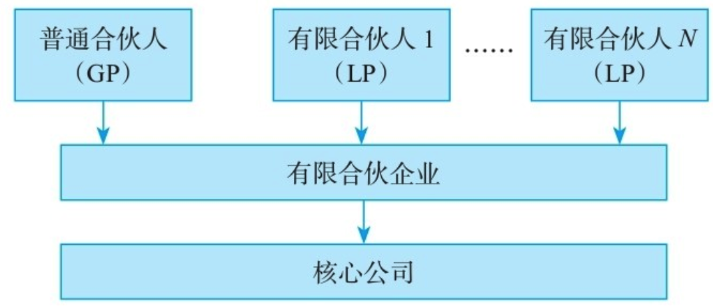

#### 2.1.2 案例1 海康威视
##### 1.上市前股权架构
甲方案为自然人直接持股，即激励对象直接持股海康威视。乙方案为自然人间接持股，即激励对象先注册成立一家持股公司，再以持股公司持股海康威视。

甲方案很快被创始人股东否决。根据《公司法》的规定，一旦有限公司改制为股份公司，每股股本将拥有同样的表决权。自然人持股方案意味着，这51个自然人不仅拥有海康威视股份的财产权，也将拥有海康威视股份的表决权。

为了方便股权集中管理，海康威视选择了乙方案，先后成立了杭州康普投资有限公司（以下简称“康普投资”）和杭州威讯投资管理有限公司（以下简称“威讯投资”）作为51名自然人的持股平台，让自然人通过两家持股公司间接持有海康威视的股份。

2010年海康威视成功登陆中小板。其上市前的股权结构如图2-4所示。

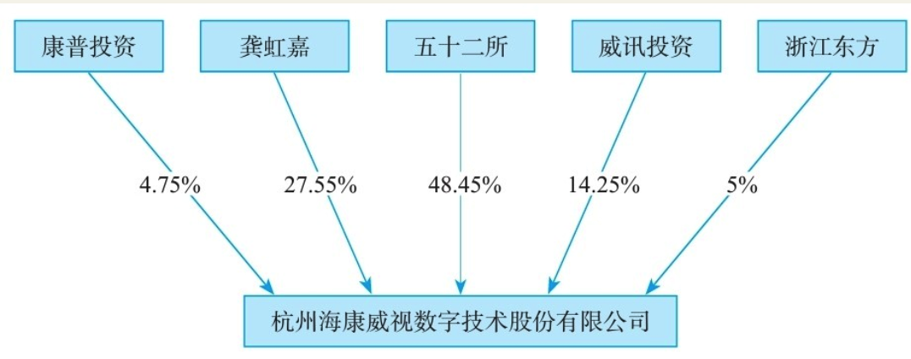

图2-4 海康威视上市前股权架构图

##### 2.痛不欲生的减持
由于当初采取了自然人→持股公司→上市公司的间接架构，未来减持套现的税负为40%，即持股公司出售海康威视股票所得交25%的企业所得税，75%的税后利润分红给员工时还需代扣代缴20%的个人所得税（75%×20%=15%税负）！如此沉重的税负，是海康威视员工无法承受之痛！怎么办？

##### 3.最终的解决之道
翻开海康威视2011年的年报，我们看到“股本变动及股东情况”一章中有如下一段文字：“公司股东杭州威讯投资管理有限公司已于2011年6月迁往新疆乌鲁木齐市，并变更为新疆威讯投资管理有限合伙企业。”“公司股东杭州康普投资有限公司已于2011年6月迁往新疆乌鲁木齐市（以下简称‘乌市’），并变更为新疆康普投资有限合伙企业。”

#### 2.1.3 有限合伙企业妙用
##### 1.纳税上的节税效应
根据《合伙企业法》的规定，合伙企业属于税收透明体，该层面并不征收所得税，经营收益直接穿透合伙企业流入合伙人账户，仅由合伙人缴纳一次所得税。在新疆，自然人合伙人的适用税率为20%。而且自然人合伙人在纳税后，当地政府会给予地方留成部分60%～80%的财政返还。

表2-1　不同持股主体减持税负比较表

1. （2.61+2.79）×25%=1.35（亿元）
2. 非纳税义务人，税负为零。
3. （2.61+2.79）×（1-25%）×20%=0.81（亿元）
4. （2.61+2.79）×20%=1.08（亿元）

以上计算中，我们尚未考虑新疆给予的财政返还，如果以个人所得税地方留成返还60%为例，员工的实际税负可能只有8 208万元。

##### 2.治理结构钱权分离
对于企业家而言，拥有股权中的话语权往往重要于拥有股权中的财产权。有限合伙企业恰好可以实现企业家心中理想的“钱权分离”。与《公司法》相比《合伙企业法》，赋予了合伙人设计机制极大的灵活性，无论是利益分配机制还是合伙人的权力分配机制，都可以在合伙协议中自由约定。合伙企业中的有限合伙，更是依据合伙人对外承担责任的类型，分成普通合伙人和有限合伙人。普通合伙人可以为创始人大股东，承担合伙企业的无限连带责任，享有合伙企业决议的全部表决权，但不分配财产权，即只要“权”，不要“钱”；有限合伙人为高管员工，不享有合伙企业的表决权，但未来可以享受合伙企业对外投资的财产收益权，即只要“钱”，不要“权”。这样的治理结构为在乎“权”者与在意“钱”者之间的合作提供了浑然天成的平台。

### 2.2 金字塔架构
#### 2.2.1 金字塔架构简介
金字塔股权架构是指公司实际控制人通过间接持股形成一个金字塔式的控制链，从而实现对该公司的控制。在这种方式中，公司控制权人控制第一层公司，第一层公司再控制第二层公司，依此类推，通过多个层次的公司控制链条取得对目标公司的最终控制权。金字塔架构是一种形象的说法，就是多层级、多链条的集团控制结构。

【例2-3】

王老板想注册成立一家天狗有限公司，注册资本100万元。如果王老板想拥有天狗公司51%的控制权，王老板需出资多少钱？一般人的回答是出资51万元。但如果采用金字塔架构，王老板仅需6.76万元便可以获得天狗公司的控制权。具体设计如图2-5所示。

图2-5 天狗公司的金字塔架构图

通过金字塔结构设计，王老板的出资只有6.76万元（现金流权），但通过几层纵向间接控股，最终拥有了对天狗公司51%的话语权（控制权）。

#### 2.2.2 金字塔架构启发
在创始人股东和拟上市公司中间搭建控股公司，即自然人→控股公司→拟上市公司，具有以下6个优点。

##### 1.股权杠杆以小博大
【例2-5】

我们来看长江润发（002435），图2-7是该公司上市前的股权架构图。

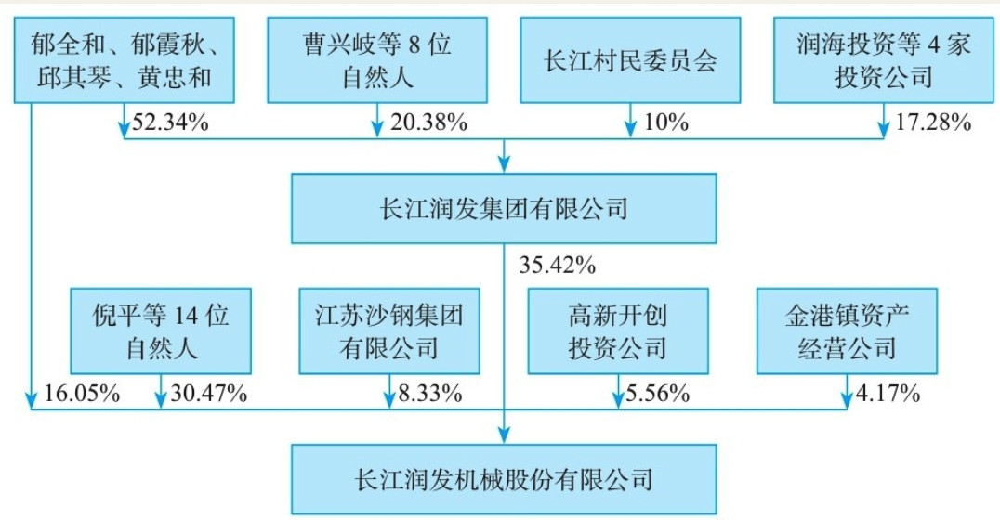

图2-7 长江润发上市前的股权架构图

公司控股股东为长江润发集团有限公司，实际控制人为郁全和、郁霞秋、邱其琴、黄忠和4位自然人。其中，郁霞秋为郁全和之女，邱其琴为郁全和之堂侄女婿，黄忠和为郁全和之妻侄，以下我们将4位自然人简称为郁氏家族。如果郁氏家族直接持股长江润发，则持股比仅为18.54%（=52.34%×35.42%）。但通过长江润发集团控股平台集中了另外对长江润发16.88%（=47.66%×35.42%）的控制权，从而只用18.54%的现金流权取得了35.42%的控制权。该架构使得郁氏家族获得了股权杠杆，用少量资金撬动了更大的控制权。

##### 2.纳税筹划效应
【例2-6】

让我们来看一个案例，图2-8为桐昆股份（601233）上市前的股权架构图。

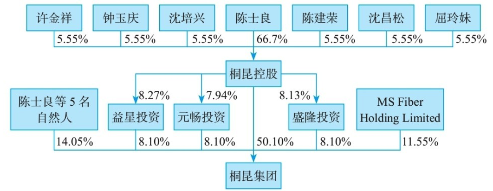

图2-8 桐昆集团上市前的股权架构图

该公司实际控制人陈士良通过桐昆控股间接持股桐昆集团。截至2017年年底，桐昆集团上市后分别进行5次分红，桐昆控股取得股息红利超过11亿元（具体计算见表2-2）。

表2-2　桐昆控股取得分配的现金股利计算表

根据《中华人民共和国企业所得税法》（以下简称《企业所得税法》）的规定，桐昆控股取得的股息红利免征企业所得税。桐昆控股在取得上述股息红利后，又进行了新的投资，先后投资了辽宁嘉成石化有限公司、安徽佑顺新材料有限公司、大连汇昆新材料有限公司、浙江佑丰新材料股份有限公司第4家公司。如果陈士良在当初设计股权架构时，采用自然人→拟上市公司的架构，即使陈士良等人取得的分红用于再投资新公司时，也需缴纳2.3亿元的个人所得税。

##### 3.便利债权融资
上市公司（或拟上市公司）上面设立控股公司，一方面，由于控股公司可以合并上市公司报表及其他产业的报表，有些控股公司资金实力强于上市公司，受到银行认可的程度较高。控股公司在上市公司银行借款、发行债券等过程中，提供相应的担保，提高上市公司债项的信用等级，降低融资成本；另一方面，控股公司可以在达到一定资产规模之后，以发行企业债等方式获得资金，开展一些不宜在上市公司（拟上市公司）内部开展的业务。

##### 4.方便人事安排
很多公司在上市时，创业元老长期跟随实际控制人，为将公司做大做强并能够实现上市做出了巨大贡献。但是上市成功之后，有些元老因为持有上市公司股票，拥有了巨额财富，丧失了事业激情，且知识结构老化，学习动力不足，已无法顺应上市公司的进一步发展，出现了躺在功劳簿上睡大觉的现象。实际控制人碍于情面又不能将他们赶走，导致上市后为公司发展做出了巨大牺牲，且一直很有想法、很有干劲的中层骨干的晋升通道被堵死了。如果在上市公司上面设有控股公司，将冲劲不足、愿意躺在功劳簿上的老管理层升至控股公司担任相应的虚职，腾出相应的职位空间给下面的中层干部，这样就既照顾了老管理层的情绪，又保证了新管理层的活力，同时打开了公司整体的晋升通道。这在目前以人治为主的公司管理中非常重要。

##### 5.控股公司单独上市
如果控股公司实力发展到一定程度，也可以单独在港股上市。

【例2-7】

2007年7月6日，旗下已拥有5家A股上市公司的复星国际在香港主板以红筹方式上市成功。复星国际完成在香港上市，不仅为集团的境外融资打通了一个新渠道，还提升了复星在国际上的影响力。郭广昌等股东也具有了境内和境外财富管理及资本运作的双通道。

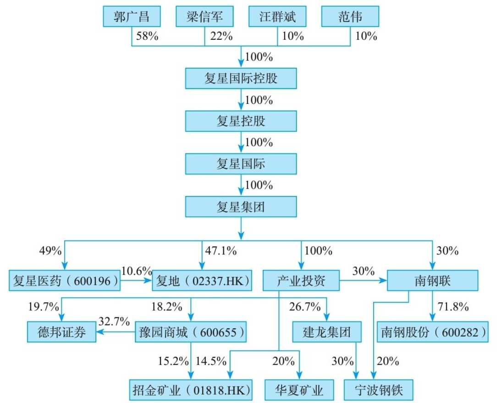

图2-9 复兴国际上市前的股权架构图

##### 6.上市后的市值管理
公司上市后，会通过减持、并购、定增、分红、资产注入、控股权转让等资本运作进行市值管理。一方面，设立控股公司可以随时准备承接上市公司的非优质资产和暂时在培育期的项目，待时机成熟后单独上市或以定向增发方式注入上市公司。例如，华润集团的“孵化模式”，便是由上市公司或战略业务单元挑选合适的项目，由集团购入项目并进行孵化，再注入上市公司。另一方面，设立控股公司可以为集团公司的现在和未来发展协调各种战略资源，安排不宜在上市公司层面安排的利益。

#### 2.2.3 两种股权架构比较
##### 1.税负的差异
【例2-9】

中国自然人张三计划设立中国X公司作为经营主体，现有两种方案（见图2-10）。假设张三持有X公司期间，取得了X公司分红。张三最终转让X公司股权，取得股权转让所得。

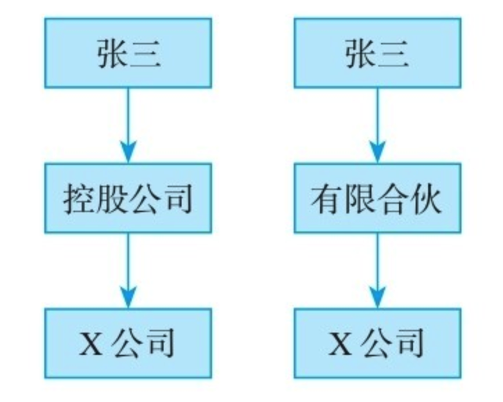

图2-10 控股公司架构和有限合伙架构

表2-3　不同持股模式下的税负对比表

1. 控股公司取得的X公司分红，免征企业所得税。见《企业所得税法》第二十七条。
2. 控股公司将从X公司投资取得的分红分配给张三，张三应按股息红利税目缴纳20%个人所得税。见《个人所得税法》第三条第五款。
3. 合伙企业不是个人所得税的纳税主体（见《关于印发〈个人独资企业和合伙企业投资者征收个人所得税的法规定〉的通知》（财税〔2000〕91号）第三条），同时合伙企业也不是企业所得税的纳税主体《企业所得税法》第一条），因此合伙企业对取得的所得无须缴纳所得税。
4. 见《〈关于个人独资企业和合伙企业投资者征收个人所得税的规定〉执行口径的通知》（国税函〔2001〕第84号）。
5. 控股公司转让X公司股权取得的所得属于财产转让所得，企业所得税税率为25%。见《企业所得税法》第六条第三款和第四条。
6. 控股公司转让X公司取得的所得缴纳了25%的企业所得税，控股公司实现75%的税后利润。75%的税后利润分配给张三，张三需缴纳20%个人所得税，即张三承担的所得税税负为：75%×20%=15%。
7. 关于自然人合伙人从合伙企业取得分配的合伙企业转让股权所得，合伙人如何缴纳个人所得税，存在几种观点，具体见本书第4章4.3.1中第1点的内容。

由表2-3可见，选择何种股权架构税负更优，与持股目的息息相关。如果自然人为财务投资者（即以获利为目的，通过投资行为取得经济上的回报，在适当的时候进行套现的投资者），采取有限合伙企业转股套现时整体税负为20%或35%，远低于控股公司架构的整体税负40%；如果是战略投资人（即与被投资公司业务联系紧密、有业务合作关系或潜在合伙意向，且欲长期持有被投资公司股份的投资者），采取控股公司架构与有限合伙企业，在取得分红收益时整体税负均为20%，但考虑到合伙企业的税收立法对纳税时点、税基计算、纳税地点等规定存在模糊性，控股公司作为持股平台为更优的选择。

##### 2.机制的弹性
《公司法》共有十三章二百一十八条，纵观这些条款多为强制性规范，比如股东进入和退出时必须经过法定的程序，一旦有限公司改制为股份公司，股份公司无法由股东约定分红等。《合伙企业法》则赋予了合伙人更多设计合伙机制的自由空间，除了极少数强制性规范外，合伙协议的条款几乎都可以根据合伙人的意志约定。所以，有限合伙企业有了更强的机制灵活性。例如，合伙协议可以约定由执行事务合伙人拥有合伙企业全部的表决权，而无须合伙人一人一票表决权。合伙协议可以约定不按出资比例对合伙人进行利润分配。

### 2.3 一致行动人
#### 2.3.1 一致行动人的概念
《上市公司收购管理办法》将“一致行动”定义为，投资者通过协议、其他安排，与其他投资者共同扩大其所能够支配的一个上市公司股份表决权数量的行为或者事实。

由上述定义可见，公司股东签署一致行动人协议相当于在公司股东会之外又建立了一个有法律保障的“小股东会”。每次在股东会表决或者协议约定事项进行时，有关各方可以在“小股东会”中先讨论出一个结果作为各方对外的唯一结果，然后再在股东会里表决或者决定事项是否进行。

《上市公司收购管理办法》对此列举了“一致行动人”的正面清单：如无相反证据，投资者有下列情形之一的，为一致行动人：

1. 投资者之间有股权控制关系；
2. 投资者受同一主体控制；
3. 投资者的董事、监事或者高级管理人员中的主要成员，同时在另一个投资者担任董事、监事或者高级管理人员；
4. 投资者参股另一投资者，可以对参股公司的重大决策产生重大影响；
5. 银行以外的其他法人、其他组织和自然人为投资者取得相关股份提供融资安排；
6. 投资者之间存在合伙、合作、联营等其他经济利益关系；
7. 持有投资者30%以上股份的自然人，与投资者持有同一上市公司股份；
8. 在投资者任职的董事、监事及高级管理人员，与投资者持有同一上市公司股份；
9. 持有投资者30%以上股份的自然人和在投资者任职的董事、监事及高级管理人员，其父母、配偶、子女及其配偶、配偶的父母、兄弟姐妹及其配偶、配偶的兄弟姐妹及其配偶等亲属，与投资者持有同一上市公司股份；
10. 在上市公司任职的董事、监事、高级管理人员及其前项所述亲属同时持有本公司股份的，或者与其自己或者其前项所述亲属直接或者间接控制的企业同时持有本公司股份；
11. 上市公司董事、监事、高级管理人员和员工与其所控制或者委托的法人或者其他组织持有本公司股份；
12. 投资者之间具有其他关联关系。一致行动人应当合并计算其所持有的股份。投资者计算其所持有的股份，应当包括登记在其名下的股份，也包括登记在其一致行动人名下的股份。投资者认为其与他人不应被视为一致行动人的，可以向中国证监会提供相反证据。

2.3.2　案例2　养元饮品

养元饮品（603156）注册成立于1997年，在2005年之前系国资企业。2005年12月，随着河北省国企改革的深化，养元饮品被以姚奎章为核心的58名员工收购，完成了养元饮品的“摘红帽子”。由于公司特殊的成长背景，养元饮品被私有化之初，公司最大的股东姚奎章的持股比例仅为30.01%，未能绝对控股。截至2016年10月（公司IPO申报前），养元饮品上市前的股权结构如图2-12所示。

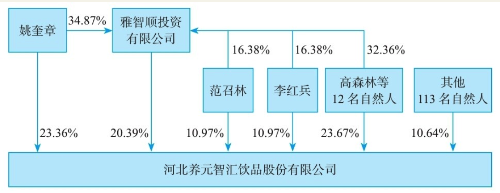

姚奎章直接持有养元饮品股份的23.36%，另外对雅智顺的持股比例为34.87%，未能拥有对雅智顺的控制权。所以姚奎章对养元饮品的现金流权虽为30.47%，控制权却仅为23.36%。除姚奎章之外的其他股东也均未能绝对控股，即任何一人凭借其股权均无法单独对公司股东大会决议、董事会选举和公司的重大经营决策实施决定性影响，养元饮品处于无实际控制人的状态！

雅智顺于2016年6月6日召开临时股东会，会议审议通过了《关于签订〈姚奎章先生与雅智顺投资有限公司一致行动协议〉的议案》。审议表决时，执行董事姚奎章进行了回避，代表有表决权资本65 128 143元的其他14名股东一致表决通过该议案。同日，姚奎章与雅智顺签署《姚奎章先生与雅智顺投资有限公司一致行动协议》。在签署一致行动人协议后，养元饮品的股权结构如图2-13所示。

通过一致行动人协议，姚奎章成为养元饮品的实际控制人，拥有了养元饮品43.75%的控制权。

#### 2.3.3 一致行动人点评
“一致行动人”较之“有限合伙企业”和“金字塔架构”效力较弱，并非最好的控制权工具，主要原因如下。

1. 一致行动人协议有“行动一致”的期限
2. 一致行动人协议可能因目的完成而被解除或撤销
3. 一致行动人协议对第三方没有约束力

#### 2.3.4 一致行动人协议
一致行动人协议内容并非法律强制性规范，所以完全取决于协议各方的合意，协议的内容非常重要，表2-4和表2-5选取了一些一致行动人协议内容供大家在实践中参考。

表2-4　一致行动人共性条款内容摘要

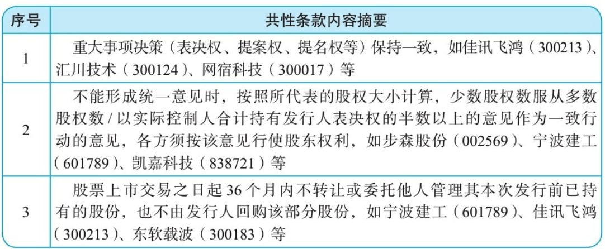

表2-5　一致行动人个性条款内容摘要

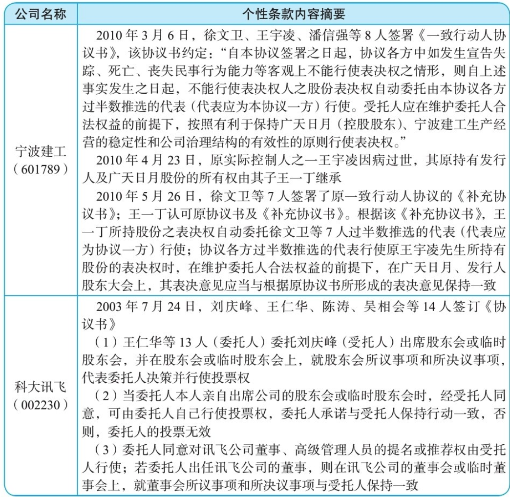

### 2.4 委托投票权
#### 2.4.1 委托投票权的定义
委托投票权（proxy voting）是指股东在股东大会召开之前已经在某些问题上进行了投票或把投票权转让给出席股东大会的其他人来行使。我国《公司法》第一百零六条规定：“股东可以委托代理人出席股东大会会议，代理人应当向公司提交股东授权委托书，并在授权范围内行使表决权。”

#### 2.4.3 委托投票权点评
常有企业家咨询委托投票权和一致行动人有什么区别？通俗一点，如果把一致行动人表述为，大股东与小股东意见一致时，听大股东的，大股东与小股东意见不一致时，仍听大股东的；委托投票权则是作为委托人的股东完全放弃表决权，交由受托人行使。因此，一致行动人需要各方均为公司股东，但委托投票权的受托方可以不是公司股东。

### 2.5 公司章程控制
公司章程被称为“公司宪法”，是股东间合作的最高行为准则，在公司内部具有最高法律地位。但非常遗憾，实践中很少有企业家对公司章程给予足够的重视。一方面，中国资本市场开放程度较低，大部分企业家觉得上市与自己相距甚远，因此公司股权结构也处于极度的闭合状态（公司股东仅限于创始人或其家族），未能引入VC/PE、高管员工、战略投资人等其他股东。

另一方面，中国数千年儒家文化的浸染，导致一部分中国企业家好面子，认为对公司章程“咬文嚼字”是彼此不信任的表现。

#### 2.5.2 公司章程要点
##### 1.有限公司
有限公司兼具“人合”和“资合”两种属性。作为持股一方，往往因其特定的技术、才能、社会资源等因素获得股东地位，股东之间存有一定的利益分配或权力制衡的因素，公司股权结构往往经过充分而细致的考量，股权结构的稳定对公司的经营和治理有着极为重要的影响。基于这种“人合”的属性，《公司法》赋予了有限公司股东对公司治理更多的自治性，股东间以公司章程对彼此权利义务进行自由约定的空间更大。以下为企业家必须了解的关于公司章程意思自治的常识。

1. 章程可以约定“分红比例与出资比例不一致”。
   1. 《公司法》第三十四条　股东按照实缴的出资比例分取红利；……但是，全体股东约定不按照出资比例分取红利……的除外。
1. 章程可以约定“不按出资比例优先认缴出资”。
   1. 《公司法》第三十四条　……公司新增资本时，股东有权优先按照实缴的出资比例认缴出资。但是，全体股东约定……不按照出资比例优先认缴出资的除外。
1. 章程可以约定“股东持股比例可与出资比例不一致”。
   1. 最高人民法院曾以（2011）民提字第6号判决书，对深圳市启迪信息技术有限公司与郑州国华投资有限公司等公司股权确认纠纷案进行判决。该案例被最高人民法院公报收录，该案裁判摘要：在公司注册资本符合法定要求的情况下，各股东的实际出资数额和持有股权比例应属于公司股东意思自治的范畴。股东持有股权的比例一般与其实际出资比例一致，但有限责任公司的全体股东内部也可以约定不按实际出资比例持有股权，这样的约定并不影响公司资本对公司债权担保等对外基本功能实现。如该约定是各方当事人的真实意思表示，且未损害他人的利益，不违反法律和行政法规的规定，应属有，股东按照约定持有的股权应当受到法律的保护。
1. 章程可以约定“表决权可与出资比例不一致”。
   1. 《公司法》第四十二条　股东会会议由股东按照出资比例行使表决权；但是，公司章程另有规定的除外。
1. 章程可以约定“剥夺股权转让时其他股东的同意权”。
    1. 《公司法》第七十一条　有限责任公司的股东之间可以相互转让其全部或者部分股权。股东向股东以外的人转让股权，应当经其他股东过半数同意。股东应就其股权转让事项书面通知其他股东征求同意，其他股东自接到书面通知之日起满三十日未答复的，视为同意转让。其他股东半数以上不同意转让的，不同意的股东应当购买该转让的股权；不购买的，视为同意转让。……公司章程对股权转让另有规定的，从其规定。
1. 章程可以约定“限制股权转让时其他股东的优先认购权”。
   1. 《公司法》第七十一条　……经股东同意转让的股权，在同等条件下，其他股东有优先购买权。两个以上股东主张行使优先购买权的，协商确定各自的购买比例；协商不成的，按照转让时各自的出资比例行使优先购买权。公司章程对股权转让另有规定的，从其规定。
1. 章程可以约定“排除股东资格的继承”。
   1. 《公司法》第七十五条　自然人股东死亡后，其合法继承人可以继承股东资格；但是，公司章程另有规定的除外。
1. 章程可以约定“书面形式行使股东会职权”。
   1. 《公司法》第三十七条　股东会行使下列职权：（一）决定公司的经营方针和投资计划；……（十一）公司章程规定的其他职权。对前款所列事项股东以书面形式一致表示同意的，可以不召开股东会会议，直接做出决定，并由全体股东在决定文件上签名、盖章。
1. 章程可以约定“召开股东会定期会议的期限”。
   1. 《公司法》第三十九条　股东会会议分为定期会议和临时会议。定期会议应当依照公司章程的规定按时召开。……
1. 章程可以约定“召开股东会会议的通知期限”。
   1. 《公司法》第四十一条　召开股东会会议，应当于会议召开十五日前通知全体股东；但是，公司章程另有规定或者全体股东另有约定的除外……
1. 章程可以约定“股东会的议事方式和表决程序”。
   1. 《公司法》第四十三条　股东会的议事方式和表决程序，除本法有规定的外，由公司章程规定。
1. 章程可以约定“董事长和副董事长的产生办法”。
   1. 《公司法》第四十四条　……董事会设董事长一人，可以设置副董事长。董事长、副董事长的产生办法由公司章程规定。
1. 章程可以约定“董事会的议事方式和表决程序”。
   1. 《公司法》第四十八条　董事会的议事方式和表决程序，除本法有规定的外，由公司章程规定。
1. 章程可以约定“执行董事的职权”。
   1. 《公司法》第五十条　股东人数较少或者规模较小的有限责任公司，可以设一名执行董事，不设董事会。执行董事可以兼任公司经理。执行董事的职权由公司章程规定。

##### 2.股份公司
如果说有限公司是“资合”公司兼具“人合”属性，股份公司则属于典型的“资合公司”。资合公司是指以公司资本和资产条件作为其信用基础的公司，不依赖于股东个人的声望、信用，股东间以出资相结合，无须相互了解，具有可公众化的特点。

股改的过程绝非形式意义上的名称变化，而是一个公司由闭合型股权结构向开放型股权结构转变的起点。企业由有限公司变更为股份公司后，有哪些不同呢？

（1）公司章程自治性弱化。有限公司的章程赋予了股东很高的意思自治空间，可以自由约定持股比例、分红比例、表决权比例、股东会议事规则等，这主要是因为有限公司股东上限为50人，成立的基础是股东间的相互信赖，是一种相对封闭的股权结构。所以，我们看到《公司法》较少用强制性规范去保护小股东的权益。

股份公司则不同，股份公司仅规定了发起人上限200人，在发起设立后，股份公司可以向全国中小企业股份转让系统申请挂牌成为非上市公众公司，也可以向证券交易所申请上市交易成为上市公司，股东人数没有上限要求。以资本聚合的小股东自然需要《公司法》保护其利益，比如降低公司章程约定的弹性，以约束大股东通过公司章程侵害小股东权益。《公司法》中关于股份公司的两章，不仅取消了有限公司股东通过公司章程对前述14个事项进行约定的权利，以期保护小股东的利益，更强化了公司对董监高的监管。例如，禁止股份公司向董监高提供借款、定期披露董监高薪酬、对董监高的股份转让加以限制等。

（2）股的流动性和包容性更强。股的流动性是指股权/股份能够以一个合理的价格迅速转化为现金的能力。它是一种所投资的时间尺度（卖出它需多长时间）和价格尺度（与公平市场价格相比的折扣）之间的关系。一个流动市场的特点是市场上在任何时刻都有买家和卖家。假如一个市场上有许多买家和卖家，那么这个市场的流动性就非常高，这样的市场被称为深市场。往往交易者更愿意向流动性高的市场（如股票交易）投资，而不太愿向流动性低的市场（如不动产）投资，原因是在一个不流动的市场上的交易者有可能以不利的价格被迫买卖。

根据《公司法》的规定，股东转让股份公司的股份，其他股东并没有优先认购权。因为本来股东间就是依赖于“资本”聚合，而非彼此信任，所以股份公司的股份转让更加自由。

根据股的流动性高低，可以把公司划分为4种类型：有限责任公司、非公众股份公司、新三板公司（非上市公众公司）、IPO上市公司。4类公司股权/股份流动性逐步增强。同时，由于股流动性的优化，也使得股份公司较之有限公司有更强的股东包容性。

（3）控制权失控可能增加。股权按流动性排序，依次为上市公司股票＞新三板公司股票＞非公众股份公司股份＞有限公司股权。流动性增加的同时也意味着股东对公司失控的可能性越来越大。

### 2.6 优先股
#### 2.6.1 优先股的含义
优先股是指依照《公司法》，在一般规定的普通种类股份之外，另行规定的其他种类股份，其股份持有人优先于普通股股东分配公司利润和剩余财产，但参与公司决策管理等权利受到限制。通俗地说，优先股股东以放弃部分表决权为代价，换取了优于普通股股东分配公司利润和剩余财产的权利。

#### 2.6.2 案例5 中导光电
中导光电（839092）成立于2006年11月，2016年10月12日挂牌新三板。公司主营业务为平板显示器（FPD）和太阳能电池（PV）前后端检测设备的研发、生产和销售。由于中导光电研发投入大，曾在挂牌前多次股权融资。挂牌时，该公司股权架构如图2-15所示。

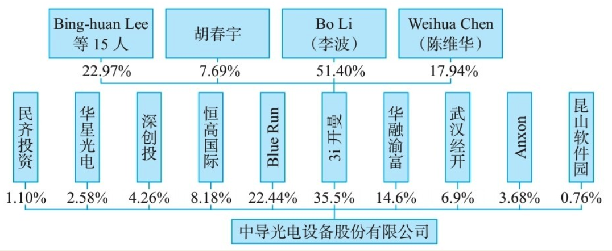

图2-15 中导光电挂牌前股权架构图

中导光电的实际控制人为Bo Li（李波）、胡春宇和Weihua Chen（陈维华）。挂牌时，该3人通过在开曼群岛设立的3i公司对中导光电持股比例合计为27.34%。3名股东中持股比例最高的为Bo Li（李波），间接持有中导光电股比例仅为18.247%。如果后续再引入投资机构，实际控制人失控的风险非常高。于是，当再次融资时，中导光电发行了优先股。

中导光电的优先股股东能享受哪些优先权益呢？

##### 1.优先获得固定股息
本次发行的优先股采用固定股息率。优先股发行的票面利率为1.00%。公司在依法弥补亏损、提取法定公积金后依照本公司经审计的母公司报表在有可分配利润的情况下，可以向本次优先股股东配发股息。优先股股东按照约定的票面利率取得股息后，不再同普通股股东一起参加剩余利润的分配。

##### 2.回售权
优先股股东在优先股限售期届满后，有权向公司回售其所持有的优先股（包括所有递延支付的股息及其孳息）。累计未支付的股息的计算方式如下：

>累计未支付的股息=累计未支付的优先股股息+累计未支付的优先股股息之孳息
>
>其中，累计未支付优先股股息=本年度应支付的股息金额-本年度已支付股息金额+过往年度未支付股息之和
>
>累计未支付的优先股股息之孳息=累计未支付的股息×当期票面利率×累计延迟支付自然天数/365

优先股股东又将放弃哪些表决权权利呢？

除法律法规或《公司章程》规定需由优先股股东表决权事项外，优先股股东没有请求、召集、主持、参加或者委派股东代理人参加股东大会的权利。

#### 2.6.3 优先股点评
优先股是一种听起来让企业家很兴奋的制度设计，让部分股东以放弃“权”为代价，去换取更低风险的“钱”；其他股东则以承担更多股权中“利”的不确定性，去换取更多的“权”。

### 2.7 AB股
#### 2.7.1 AB股的概念
通常公司的股权结构为一元制，即所有股票都是同股同权、一股一票，但在英美法系下的类别股份制度里存在二元制股权结构（又称AB股结构），即管理层试图以少量资本控制整个公司，因此将公司股票分高、低两种投票权，高投票权的股票每股具有N票（多为10票）的投票权，称为B类股，主要由管理层持有；低投票权由一般股东持有，1股只有1票甚至没有投票权，称为A类股。作为补偿，B股股票一般流通性较差，一旦流通出售，即从B类股转为A类股。

#### 2.7.2 案例6 小米集团
2018年7月9日，小米集团正式在香港证券交易所上市，股票代码01810.HK。虽然发行当日出现跌发，但估值依然在543亿美元左右，跻身有史以来全球科技股IPO前三名。小米集团对于香港股市具有里程碑意义，因为其是首家在香港上市的“同股不同权”（AB股）的公司。小米集团的创始人雷军持有小米集团31.4124%的股份，但投票权为57.9%。雷军是如何做到的呢？让我们来看看小米集团上市前的股权结构图，如图2-17所示。

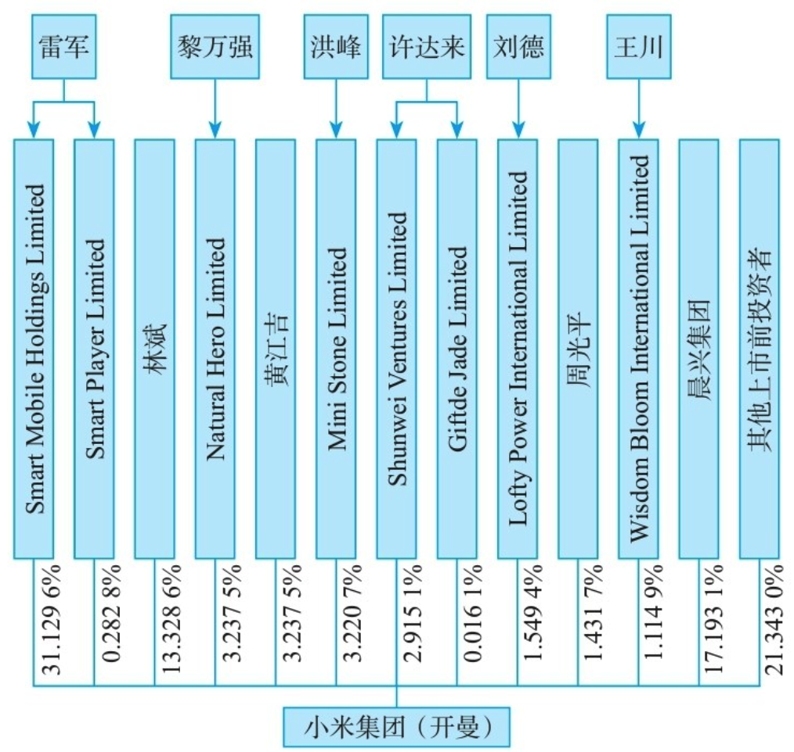

图2-17 小米集团上市前的顶层股权架构图

根据小米集团公开发行的存托凭证招股说明书，截至2018年6月30日，小米集团已发行的股份种类和股份数量如表2-8所示。

表2-8　小米集团已发行的股份种类和股份数量

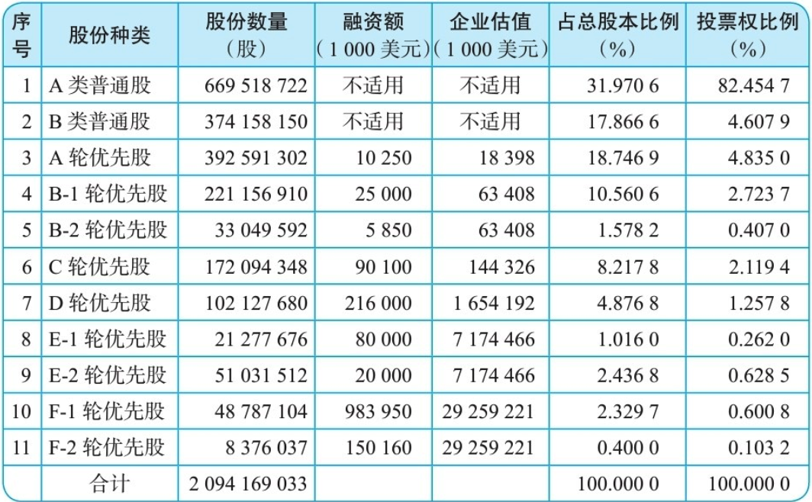

##### 1.AB股架构
小米集团的招股说明书披露，上市前小米集团的公司章程约定了不同的投票权架构。持有公司A类普通股的股东为Smart Mobile Holdings Limited（雷军的持股平台）、林斌、as trustee of Bin Lin TRUST（林斌的持股平台）。投票权架构中关于A类普通股与B类普通股和其他各轮优先股的设计区别在于对于审议事项时所能代表的投票权数量。除涉及极少数保留事项有关的决议案外，对于提呈公司股东大会的任何决议案，A类股份持有人每股可投10票，而B类股份持有人每股可投1票。对于保留事项的议案，A类股份、B类股份每股股份均只有1票投票权。保留事项包括：①修订章程或细则，包括修改任何类别股份所附的权利；②委任、选举或罢免任何独立非执行董事；③委任或撤换公司会计师；④公司主动清算或结算。此外，持有不少于公司实缴股本1/10并附带股东大会投票权的股份股东（包括B类股份持有人），有权召开本公司股东特别大会，并在会议议程中加入决议案。

根据香港联合交易所有限公司的《上市章程》规定，小米集团在香港上市之日后将继续实行的特殊投票权架构为：A类普通股为一类，B类普通股为另一类；在股东投票时，每一A类普通股股份有10份投票权，每一B类普通股或优先股股份有1份投票权。

##### 2.优先股架构
小米集团在上市前进行了9轮融资，对这些投资人，公司章程中约定了优先股条款，具体如下。

1. 股息权。若公司董事会宣告发放股利，优先股股东有权优先于现有或未来的普通股或任何其他类别股份持有人，按初始投资额享有年利率为8%的非累积优先股股利。除非已经将优先股股利支付完毕，否则本公司不得以现金或任何其他方式向任何普通股或其他类别股份持有人支付、宣告或者分派股利。
1. 转换权利。2015年7月3日后，优先股持有人有权将所持有优先股转换为B类普通股；或在达到下列条件时，优先股将自动转换为本公司的B类普通股：
   1. 完成合格上市。合格上市是指本公司股份根据适用的法律在香港证券交易所、纽约证券交易所或纳斯达克上市并交易，且上市时的市值不低于特定金额；或经本公司持股50%以上的A轮、B轮、C轮、D轮、E轮和F轮优先股股东或该等优先股转换后的B类普通股股东同意，在满足前述市值条件的前提下，在香港证券交易所、纽约证券交易所或纳斯达克相似的地区的证券交易所上市。
   2. 对于A轮优先股，持股A轮优先股超过50%的投资人书面同意；对于B轮（B1轮、B2轮、B+轮及B++轮）优先股（“B轮优先股”），持股B轮优先股超过2/3的投资人书面同意；对于C轮（C轮及C+轮）优先股（“C轮优先股”），持股C轮优先股超过2/3的投资人书面同意；对于D轮优先股，持股D轮优先股超过2/3的投资人书面同意；对于E轮（E1轮及E2轮）优先股（“E轮优先股”），持股E轮优先股超过2/3的投资人书面同意；对于F轮（F1轮、F2轮）优先股（“F轮优先股”），持股F轮优先股超过2/3的投资人书面同意。
1. 赎回权利。如果本公司在2019年12月23日前没有完成合格上市，则自该日起，除F轮优先股股东外的其他优先股股东或多数F轮优先股股东均有权要求本公司以如下价格孰高赎回行使该权利的优先股股东所持有的所有优先股：
   1. 投资成本加年8%的复利及已计提但尚未支付的股利。
   2. 赎回时点优先股的公允价值。该公允价值需要由本公司和多数投资者选定的独立第三方评估机构按照合理的估值方法确定。估值时不应考虑任何流动性或少数股权折扣的影响。
2. 优先清算权利。当本公司发生清算、破产或其他自愿或非自愿的解散事件时，于偿清所有债权人的债务及根据法律可能须优先偿还的债务后，须按下列方式向本公司股东做出分配：每名优先股股东因拥有有关股份，可就所持各系列优先股按优先级优先于其他系列优先股及普通股或任何其他类别或系列股份股东收取本公司任何资产或盈余资金分配，金额等于E系列优先股、D系列优先股、部分C系列优先股、部分B系列优先股及部分A系列优先股各自适用的发行价100%另加相关优先股应计或已宣派但未支付的股息，或除上述股份外其他系列优先股各自适用的发行价110%另加相关优先股应计或已宣派但未支付的股息。若可供分配的资产及资金不足以向相关股东全部支付优先受偿的金额，则按以下顺序向优先股股东支付清算优先受偿的金额：第一为F系列优先股股东，第二为E系列优先股股东，第三为D系列优先股股东，第四为C系列优先股股东，第五为B系列优先股股东，最后为A系列优先股股东。向所有优先股股东分派或悉数支付清算优先受偿金后，本公司可供分派予股东的剩余资产（如有）须基于各股东当时按经转换基准所持普通股数目，按比例分派予优先股及普通股股东。

##### 3.委托投票权
小米集团的其他股东和雷军签署了投票权委托协议，雷军作为受托人可实际控制另外2.2%的投票权。

##### 4.公司章程约定
小米集团公司章程约定，在公司股东大会上，对于应当由普通决议通过的事项，由出席股东大会的股东所持的过半数的投票权赞成方可通过；对于应当由特别决议通过的事项，由出席股东大会的股东所持的超过3/4的投票权赞成方可通过。

通过上述几种方式，除设计优先股特别决议事项的部分情形外或按照适用的法律或上市规则的规定需要雷军回避表决的事项外，雷军在小米集团上市时控制的投票权为57.9%。因此，该等投票权可以决定应当由普通决议通过的事项是否可以通过，并对应当由特别决议通过的事项享有否决权。此外，雷军还是小米集团的董事长和首席执行官，因此，虽然雷军的持股比例并不是很高，但是小米集团的实际控制人。

## 第3章 分股的“道”和“术”
### 3.1 分股之道
#### 3.1.3 驭人性：案例9 真功夫
股权的内核是“人性”，每一部股权战争史，莫不是人性贪嗔痴的展现。让我们来看一个案例——“真功夫股权纠纷案”。

打开真功夫餐饮管理有限公司的股权结构图，我们看到公司最大的两个股东蔡达标和潘宇海的持股比均为41.74%。从2003年开始，蔡达标担任真功夫总裁。作为运营的主角，蔡达标对真功夫的控制欲望受到了持股比例的桎梏，于是蔡达标找到潘宇海协商调整持股比例，在协商不成的情况下，蔡达标开始实施“金蝉脱壳”，将真功夫的资产逐步非法转移至个人名下，最后因触碰了法律的底线锒铛入狱。蔡达标的失败固然有其对法律的蔑视无知，但究其根源更是因为潘宇海并未认可蔡达标在真功夫公司运营中的价值，进而否定了蔡达标的控股，从而导致了二人的控股权大战。

联想集团创始人柳传志先生有个非常著名的`大鸡小鸡论`，大意如下：有三种动物——鸡、火鸡、鸵鸟，共同生活在一个动物园里，因此，难免在相遇之际相互端详一下，比比个头大小。如果是两只鸡相遇，双方的印象大概是这样：“你比我要小”。如果是一只鸡与一只火鸡相遇，火鸡会认为自己比鸡大得多，而鸡则会认为，咱们的个头差不了多少。如果是一只鸡与鸵鸟相遇，鸡一般都会承认对方的个头确实比自己大。一只年老而觉悟了的鸡，得出两点认识：在缺少比较的情况下，很容易高估自己；想要开眼界，就不能一生一世总在鸡群中相望。而那只鸵鸟则感慨道：如果要想获得别的动物认可的优势，需要比它们高出许多。柳传志先生最后总结：“你真的只有把自己锻炼成火鸡那么大，小鸡才肯承认你比它大，当你真像鸵鸟那么大时，小鸡才会心服。只有赢得这种心服，才具备了在同代人中做核心的条件。”在真功夫的案例中，如果创业之初，潘宇海和蔡达标都是小鸡，那么在扩张期在股东潘宇海眼中，蔡达标并未成长为鸵鸟，充其量只是火鸡而已。因此，由蔡达标来独自运营真功夫，潘宇海自然不会同意，在股权均分的背景下，控制权战争也就在所难免了。

### 3.2 分股之术
#### 3.2.1 vesting制度
##### 1.vesting制度介绍
No1：来自真格基金的【种子期/pre-A轮优先股融资协议】

>“创始人股份限制　各创始人25%的股份将于交割后一年时悉数归属，各创始人其余75%的股份将在之后三年内等额分期归属。”

No2：来自YC的创始人股份限制条款

>Employee Option　All employee options to vest as follows:25% after one year.With remaining vesting monthly over next 36 months.All founders equity shall be subject to a repurchase right which also reflects a standard 4 year vesting schedule.

【例3-1】

>某创业公司有3位股东，张三出资500万元，李四出资300万元，王五出资200万元，并约定“出多少钱占多少股”。公司运营1年后，李四与张三、王五理念不和，要离职，于是问题出现了，李四出资300万元占了公司30%的股份，怎么办？李四不同意退股，理由很充分：第一，这30%的股份是自己真金白银花300万元买的，退了，不合理；第二，《公司法》和公司章程都没有规定股东离职还要退股，退了，不合法。张三和王五深感不平，却无计可施，他们确实没理由把李四的股权收回来！当然还有另外一种可能，李四同意退出，但对转股价格各方扯皮，导致退股遥遥无期。李四退出公司运营后，对公司价值已再无贡献，占股比例如此之大，势必导致股权结构畸形。股权是公司机器运转的原动力，动力系统出问题，严重影响公司的后续发展，这该如何是好？
>
>我们是否可以换一种方式思考问题，如果创业之初持股比例必须固化，是否可以在调整机制和退出机制上做做文章。比如创始人股权的20%，在公司创始时，就马上vesting（兑现）。剩下的80%分4年vesting。依此约定，如果李四一年后离开的话，他会拿到30%×20%=6%的股权，加上创始时的6%，共12%的股权。剩下18%的持股将被其他股东以对应的原始出资价格回购。

vesting条款有很多的细节设计空间，具体如下：

1. vesting的周期，可以是3年、4年、5年等。一般来说，创业时公司创新度越高，试错期越长，vesting的周期可能会约定得越长。
2. vesting的比例，可以每年平均，也可以逐年递增。比如，第1年10%，第2年20%，第3年30%，第4年40%，逐年递增。360公司按照类似的模式：全职满2年成熟50%，第3年75%，第4年100%。国外常见的模式是：5年成熟，干满1年成熟1/5，剩下的每月成熟1/48。
3. vesting的节点，可以是12个月、6个月、3个月。比如，真格基金的投资条款“各创始人25%的股份将于交割后一年时悉数归属”，这意味着，哪怕创始人做了11个月零29天离开，也没有这个股权，必须做满12个月。这在硅谷资本圈中称作“cliff”，直译为“悬崖”。但也有的公司是一年内的cliff同真格投资条款里说的一样，满一年之后一次性给25%，后3年的时候是每个季度兑现，也就是说每个季度，你都能拿到25%的1/4，这样如果你干了18个月离开，最后干的6个月也不是没有收获的。
4. vesting的归属。如果创业之初，股东无法预知谁贡献更大，可暂时vesting部分股权，没有vesting的部分待股东会再行商议决定如何归属。

##### 2.vesting的实操
股权兑现术操作要点如下：

1. 高度重视公司章程。我国《公司法》虽然没有规定股权兑现机制，但赋予了有限公司股东通过公司章程对退出机制进行设计的空间。比如在公司章程中规定，股东如被本公司辞退、除名、自由离职、退休、死亡或公司与其解除劳动关系的，其股权需被强制回购。这在司法上有被认定有效的案例。但是如果vesting机制未能体现在公司章程条款中，股东离开公司时，强制回购其未兑现的股权可能因缺乏法律依据而无法操作。
2. 未兑现股份的处理。在国外，当创始人提前离开公司时，通常由公司行使回购权，回购尚未vesting的股权。而在我国《公司法》下，除特殊情况外，公司不得持有自己的股权，所以不能独立行使回购权，必须由其他股东行使或者是公司进行减资操作。这是中外实践的一个主要差别。在股权兑现期，公司可能引入新股东，有可能是财务投资人（VC/PE），也有可能是产业链上下游的战略投资人，还有可能是进行了股权激励的公司高管。公司章程需约定，股东离开时未vesting部分的处理，一般有3种方式：①由所有股东（不包括离开股东）按持股比例回购；②由最大股东回购；③公司减资，所有股东持股比例反向稀释。
3. 股权回购的价格和程序。股东退出时，股权回购的价格是敏感地带，如果事先未能在公司章程中进行规定，可能会因为回购价格的分歧导致vesting机制功亏一篑。回购价格既可以是原始出资额，也可以是原始出资额加年化利息（单利或者复利），还可以是上一年度经审计的公司净资产等。同时提前约定股权回购的流程和违约责任，也非常有必要。
4. 特殊情形的处理。当有限公司股改为股份公司，进入对接资本市场的预备期，股份公司的章程将面临重新约定。由于《公司法》对两种类型公司章程约定事项的规定不同，vesting机制可能在股份公司失灵。另外，当公司出现收购、合并、分立等重大并购重组事项时，也应提前明确尚未兑现股权的处理方式。

# 第二部分 主体架构
## 第4章 有限合伙架构
### 4.1 有限合伙架构简介
在这种架构模型里，股东并不直接持有核心公司股权，而是通过有限合伙间接持股核心公司（见图4-1）。

该架构的搭建过程为：

1. 创始人（实际控制人）设立一人有限公司。
2. 一人有限公司作为普通合伙人（GP），高管等作为有限合伙人（LP），共同设立有限合伙企业。
3. 有限合伙企业持股核心公司。

### 4.2 案例10 蚂蚁金服
在蚂蚁金服的26名股东里，我们并没有看到马云的名字。于是我们继续在蚂蚁金服股东的股东里寻找，终于在蚂蚁金服股东“君瀚合伙”的股东里找到了马云的身影，他出资2 000万元，成为君瀚合伙的有限合伙人，出资比例为1.88%（见图4-2）。

也就是说，马云通过“君瀚合伙”间接持股蚂蚁金服，算下来马云间接持有蚂蚁金服比例约0.79%。但至此，我们依然看不透马云是如何掌控蚂蚁帝国的。我们继续追踪“君瀚合伙”的普通合伙人（GP）云铂公司。“云铂公司”注册资本1010万元，唯一的股东便是马云。另外，蚂蚁金服另外一个股东“君澳合伙”的GP也是云铂公司。至此，真相大白。从图4-3便能看清马云的股权布局。

马云的全资子公司云铂公司做GP，其他阿里系高管做LP。我们在第2章介绍过，有限合伙架构可以实现钱权分离，GP出资很少，但可在合伙协议中约定享受全部话语权；LP虽然没有话语权，但未来可享受投资收益财产权。马云控制云铂公司→云铂公司控制君瀚、君澳→君瀚、君澳控制蚂蚁金服，马云轻轻松松用1070万元资金，就撬动起一个万亿市值的金融帝国。
不过，细心的你是否注意到，马云并没有直接成为两家合伙企业的普通合伙人（GP），而是先注册成立了云铂公司，让云铂公司成为普通合伙人（GP）。如此折腾为哪般？原因可能有二：

1. 风险隔离。按《合伙企业法》的规定，普通合伙人要对合伙企业的债务承担无限连带责任。马云设置了云铂公司作为GP，如此，两个合伙企业的债务均由云铂公司承担无限连带责任，好似一道防火墙，隔离了马云对君瀚合伙和君澳合伙的连带责任。
2. 调整灵活。如果马云作为有限合伙企业的GP，则不能再作为有限合伙企业的LP。但通过云铂公司做GP，马云既可以行使GP的权力，又可以再做合伙企业的LP。除此之外，如果未来更换GP，也不必修改君瀚的合伙协议，仅在云铂公司层面更换股东即可。

为什么马云要设立两个合伙企业君瀚和君澳呢？如果我们对蚂蚁金服股权结构继续刨根问底，就会发现，云铂公司做GP的合伙企业可不止君瀚和君澳两个，还有君洁合伙、君济合伙（见图4-4）。

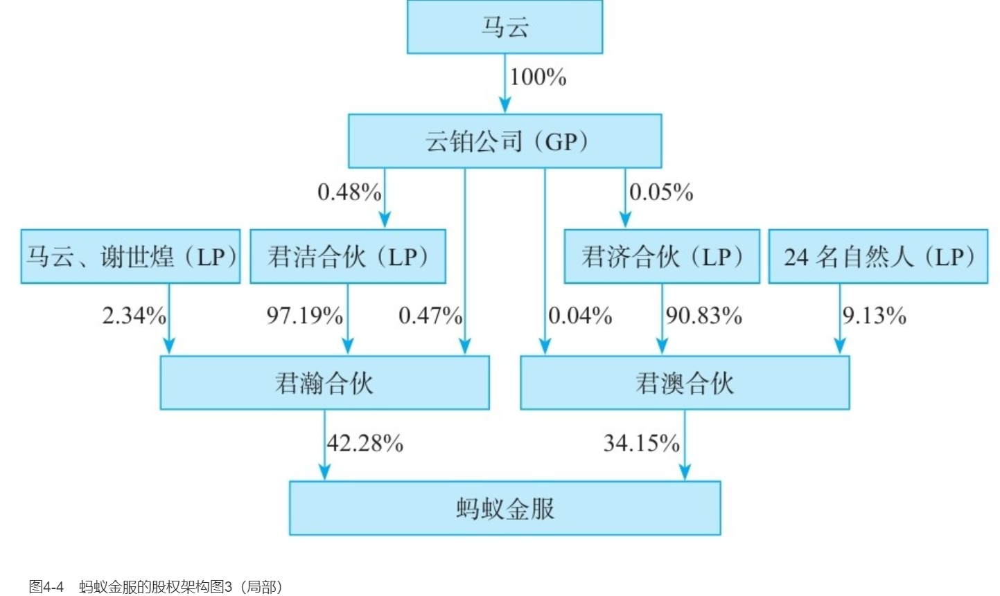

马云为什么要设立这么多合伙企业，还要合伙企业嵌套合伙企业？答案是，方便进入和退出。股权一经工商登记便具有公示效力，但经营并非一成不变，在漫长的上市等待期，不排除有新的合伙人进入和老的合伙人退出。新人的入股价格和持股条件可能与老人不同，退出机制也可能有差异。但不管新人、老人持股，均需通过合伙协议约定进退规则。如果把所有的合伙人放在一个合伙企业的池子里，势必增加合伙协议的复杂程度和难度系数，很容易发生法律纠纷。所以，将股东分类装入不同的合伙企业，不仅方便管理，还便于约定退出机制。

### 4.3 有限合伙架构实操要点
#### 4.3.1 合伙企业的税收陷阱
1. 退出税率的不确定性
2. 持有期的分红收益需纳税
    - 企业家通过合伙企业取得被投资公司分配的股息红利，需要缴纳个人所得税。以马云为例，马云作为君瀚合伙的有限合伙人，君瀚合伙取得从蚂蚁金服分回的股息红利，马云需要缴纳20%的个人所得税。但如果持股平台为有限公司，即马云→持股公司→蚂蚁金服的股权结构，持股公司取得蚂蚁金服分回的股息红利，免征企业所得税。
1. 不享受针对个人税收优惠
    - 根据税法规定，个人持有新三板公司或者上市公司的股票，其取得的股息红利可以根据持股期限享受优惠税率，但如果个人通过合伙企业间接持股，则无法享受上述税收待遇。另外，中小高新技术企业用资本公积、盈余公积、未分配利润转增股本时，个人股东可以申请递延纳税的税收优惠，但如果个人通过合伙企业间接持股中小高新技术企业，则无法享受上述税收待遇。

#### 4.3.2 合伙企业注册地陷阱
1. 税收洼地
    - 在实务中，有越来越多的企业选择合伙企业作为持股平台，也有很多企业出于税负的考虑，选择在西藏山南、新疆霍尔果斯等地注册有限合伙企业，因为这类地区常给予企业两种税收福利：核定征收和财政返还。这类给予特殊税收待遇的地区被行业内称为“税收洼地”。
1. 财政返还

### 4.4 有限合伙架构适用情形
#### 4.4.1 钱权分离度极高的创始人股东
对于一些资金密集型的行业，如互联网公司，VC/PE在企业发展中起到了至关重要的作用，属于举足轻重的股东。如果创始人预判，自己及管理团队的持股比例会被稀释得非常低，为了控制权的需要，可以采取该种有限合伙架构，并尽可能让投资人或高管员工通过有限合伙企业间接持股核心公司（拟上市公司），创始人自己则作为有限合伙企业的普通合伙人。

【例4-3】

>绿地集团的实际控制人、董事长张玉良曾将合伙企业架构用到了极致，仅用3.028万元控制了绿地集团188亿元的资产。图4-5为绿地集团借壳上市时的股权架构。

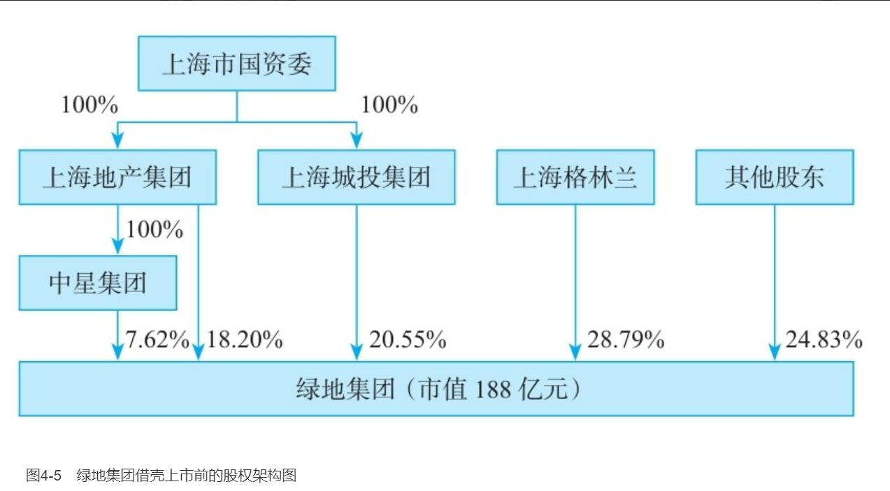

>在上述股东中，“上海格林兰”全称为“上海格林兰投资企业（有限合伙）”，其股权结构如图4-6所示。

#### 4.4.2 有短期套现意图的财务投资人
如前所述，选择在税收洼地注册合伙企业，合伙人可能享受核定征收或者财政返还的地方优待。如果投资人投资后，有短期内套现的计划，可以考虑有限合伙企业架构。

【例4-4】

>月亮公司创始人罗先生计划一年内将月亮公司股权以1亿元价格出售给上市公司。如果罗先生直接持股月亮公司，他应缴纳20%的个人所得税。假设投资成本为1 000万元，则税负为（10 000-1 000）×20%=1 800（万元）。但是，如果罗先生通过注册在税收洼地的合伙企业间接持股，最低可能将税负降至10 000×10%×35%=350（万元）（采取核定征收）或者（10 000-1 000）×20%×（1-40%×90%）=1 152（万元）（假设地方留成税款的90%给予财政返还）。

#### 4.4.3 员工持股平台
本书第2章2.1节中介绍过海康威视的案例。我们知道当股权激励的对象较多时，以合伙企业作为员工持股平台，不仅方便对股权进行管理，还有利于大股东获得更多的控制权。

## 第5章 自然人直接架构
### 5.1 自然人直接架构简介
在这种架构模型里，自然人股东均直接持有核心公司股权，如图5-1所示。

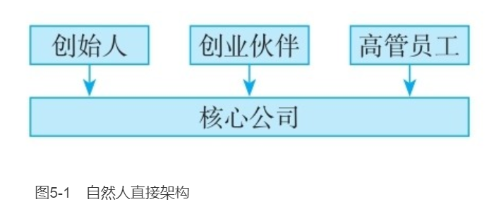

### 5.3 自然人直接架构点评
#### 5.3.1 自然人直接架构的优点
##### 1.套现个税可预期
较之税收立法尚未成熟的合伙企业，自然人直接出售股票的税政非常明确。根据税法规定，个人转让限售股，以每次限售股转让收入，减除股票原值和合理税费后的余额，为应纳税所得额，即

    应纳税额=[限售股转让收入-（限售股原值+合理税费）]×20%

表5-1　不同持股架构下，自然人股东套现个税税负表

1. 上述限售股是指：a.上市公司股权分置改革完成后股票复牌日之前股东所持原非流通股股份，以及股票复牌日至解禁日期间由上述股份孳生的送、转股；b.2006年股权分置改革新老划断后，首次公开发行股票并上市的公司形成的限售股，以及上市首日至解禁日期间由上述股份孳生的送、转股（以下统称新股限售股）。见《财政部 国家税务总局 证监会关于个人转让上市公司限售股所得征收个人所得税有关问题的通知》（财税〔2009〕167号）。
2. 见《关于个人转让股票所得继续暂免征收个人所得税的通知》（财税字〔1998〕061号）和《关于个人转让全国中小企业股份系统挂牌公司股票有关个人所得税政策的通知》（财税〔2018〕137号）。

##### 2.套现可免征增值税
表5-2　不同持股模式下增值税税负表

- ①②非上市公司股权不属于金融商品，因此不是增值税的征税范围。
③在“营改增”之前，各地税务局执行口径不一，大部分地区不征；“营改增”后，征收增值税，见《国家税务总局关于营改增试点若干征管问题的公告》（国家税务总局2016年53号）第五条。
- ④同①。
- ⑤同③。

##### 3.上市后套现可选择纳税地点
表5-3　不同持股模式下，纳税地点比较表

- ①《关于发布〈股权转让所得个人所得税管理办法（试行）〉的公告》（国家税务总局公告2014年第67号）第十九条规定：“个人股权转让所得个人所得税以被投资企业所在地地税机关为主管税务机关。”
- ②《财政部　国家税务总局　证监会关于个人转让上市公司限售股所得征收个人所得税有关问题的通知》（财税〔2009〕167号）规定：“限售股个人所得税由个人股东资金账户开户的证券机构所在地主管税务机关负责征收管理。证券机构向所在地主管税务机关申报解缴预扣的税款，个人向股东资金账户开户的证券机构所在地主管税务机关提出清算申报，办理清算事宜。”
- ③④⑤《财政部　国家税务总局关于印发〈关于个人独资企业和合伙企业投资者征收个人所得税的规定〉的通知》（财税〔2000〕91号）第二十条规定：“投资者应向企业实际经营管理所在地主管税务机关申报缴纳个人所得税。投资者从合伙企业取得的生产经营所得，由合伙企业向企业实际经营管理所在地主管税务机关申报缴纳投资者应纳的个人所得税，并将个人所得税申报表抄送投资者。”
- ⑥⑦⑧见《企业所得税法》第五十条：“除税收法律、行政法规另有规定外，居民企业以企业登记注册地为纳税地点；但登记注册地在境外的，以实际管理机构所在地为纳税地点。”

#### 5.3.2 自然人直接架构的缺点
1. 不利于控制权集中
2. 缺乏利用股权杠杆的空间
    - 股权杠杆是指实际控制人通过对一系列公司的股权安排，用较小的资金，达到控制巨额资金的方法。
3. 对于长期持股股东来说税负较高
    - 如果股东持有的股权不计划出售套现，而是长期持有，每次取得分红即使是用于再投资也需要缴纳个人所得税。而且，被投资公司以未分配利润、盈余公积、资本公积转增股本，自然人股东均需缴纳个人所得税。

#### 5.3.3 自然人直接架构适用情形
1. 规划上市后售股套现的财务投资人
    - 拟上市公司的股东，如果规划公司上市后把股票出售套现，最好采用自然人直接架构，不但套现时可以直接通过证券交易账户便利操作，而且税负较低。
2. 创业期的创始人股东
    - 创业期，商业模式尚未打磨成熟，股权结构也不稳定，公司能否存活下去也尚未可知，所以不宜把股权结构设计得过于复杂。待公司商业模式渐趋成熟，公司盈利前再做股权架构设计，然后再对股权结构进行调整。

## 第6章 控股公司架构
### 6.1 控股公司架构简介
在这种架构模型里，创始人及其创业伙伴设立控股公司，控股公司旗下有多个业务板块管理公司，每个业务板块管理公司下投资N家实体公司，如图6-1所示。

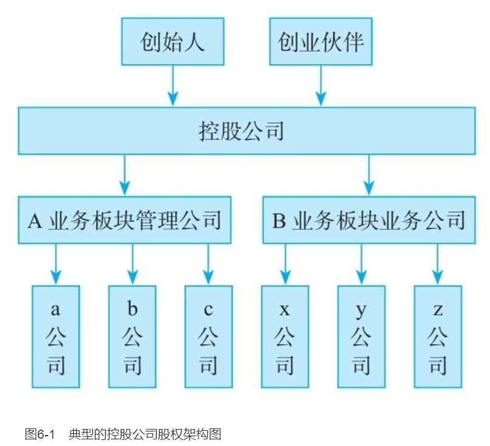

### 6.3 控股公司架构点评
#### 6.3.1 控股公司架构的优点
在第2章所讲的金字塔架构中，我们曾总结过金字塔架构的优点，具体包括：股权杠杆，以小博大；集中股权，提升控制力；有纳税筹划效应；便利债权融资；有助于人事安排；控股公司单独上市；方便上市后的资本运作等，其实控股公司架构就是一种金字塔架构。

#### 6.3.2 控股公司架构的缺点
1. 股东最终退出时税负太高
    - 自然人→持股公司→核心公司的架构，由于存在持股公司缴纳企业所得税和自然人缴纳个人所得税两道税负，所以并不适合未来有明确套现目的的财务投资人。
2. 缺乏灵活性
    - 较之合伙企业，控股公司制度少了设计的灵活性，具体可见本书第2章“2.2.3两种股权架构比较”中的“2.机制的弹性”。所以，对于需要更加灵活的退出机制的员工持股平台，往往用有限合伙架构更合适。

#### 6.3.3 控股公司架构适用情形
控股公司架构适用情形包括：

1. 规划长期持股的实业家。
1. 有多个业务板块的多元化企业集团。
1. 作为大股东的家族持股平台。
1. 已进入成熟期，但没有上市规划，打算家族传承的实业家。

## 第7章 混合股权架构
### 7.1 混合股权架构简介
典型的混合股权架构如图7-1所示，创始人股东及其家人设立控股公司A，控股公司A与创业伙伴持有控股公司B，控股公司B投资设立控股公司C，控股公司C可能会引入战略投资人，控股公司C持有部分核心公司股权；创始人和创业伙伴直接持股部分核心公司股权；高管和员工通过有限合伙企业持有核心公司股权。

### 7.3 混合股权架构点评
在混合股权架构中，根据股东不同的持股目的，组合不同的持股架构。

1. 创始人大股东
    - 如果创始人大股东在公司上市后计划长期持股上市公司，可选择设立控股公司作为持股平台，方便上市公司进行资本运作。当然，创始人大股东也可以直接持股一部分股权，以便未来减持套现更加便利。
2. 创业伙伴
    - 创业伙伴可以参考创始人股东的持股架构。
3. 高管员工
    - 拟上市公司可以设计有限合伙企业架构作为股权激励持股平台架构，高管员工为有限合伙人，创始人作为普通合伙人。如果创始人是风险厌恶型，可设立有限公司作为普通合伙人。具体原因见第4章蚂蚁金服的案例。

### 7.4 混合股权架构适用情形
混合股权架构适用于有明确境内上市规划的公司。

## 第8章 海外股权架构

