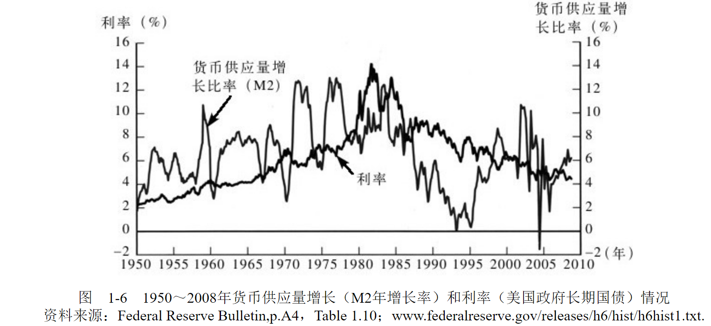

    作者: 弗雷德里克 S.米什金(Frederic S.Mishkin)
    出版社: 机械工业出版社
    译者: 马君潞 / 张庆元 / 刘洪海
    出版年: 2011-6-1
    页数: 520
    定价: 75.00元
    装帧: 平装
    丛书: 华章教材经典译丛
    ISBN: 9787111342618

[豆瓣链接](https://book.douban.com/subject/6516229/)

- [第一篇 导论](#第一篇-导论)
  - [第1章 为什么要研究货币、银行和金融市场](#第1章-为什么要研究货币银行和金融市场)
    - [1.1 研究金融市场的原因](#11-研究金融市场的原因)
      - [1.1.1 债券市场和利率](#111-债券市场和利率)
      - [1.1.2 股票市场](#112-股票市场)
    - [1.2 研究银行和其他金融机构的原因](#12-研究银行和其他金融机构的原因)
      - [1.2.1 金融体系的结构](#121-金融体系的结构)
      - [1.2.2 金融危机](#122-金融危机)
      - [1.2.3 银行与其他金融机构](#123-银行与其他金融机构)
      - [1.2.4 金融创新](#124-金融创新)
    - [1.3 研究货币和货币政策的原因](#13-研究货币和货币政策的原因)
      - [1.3.1 货币与经济周期](#131-货币与经济周期)
      - [1.3.2 货币与通货膨胀](#132-货币与通货膨胀)
      - [1.3.3 货币与利率](#133-货币与利率)
      - [1.3.4 货币政策的执行](#134-货币政策的执行)
      - [1.3.5 财政政策与货币政策](#135-财政政策与货币政策)

# 第一篇 导论
## 第1章 为什么要研究货币、银行和金融市场
### 1.1 研究金融市场的原因
#### 1.1.1 债券市场和利率
`证券（security）`，又称金融工具，是对于发行者未来收益或者`资产`（asset，财务求偿权或者具有所有权的财产）的一种求偿权。`债券（bond）`是承诺在约定期限内定期偿付的债务证券。`债券市场`能够帮助公司和政府筹集到运营资金，并且能够决定利率，因此它对经济运行具有十分重要的意义。`利率（interest rate）`是借款的成本或者用于偿付资金租费的价格（通常用100美元年租费占100美元的百分率来表示）。在经济运行过程中，存在着多种利率——抵押贷款利率、汽车贷款利率以及各种债券利率等。

#### 1.1.2 股票市场
`普通股（common stock，通常简称为股票（stock））`代表了其持有人对于公司具有一定份额的所有权，代表了对公司的资产和收益具有的求偿权。发行和向公众销售股票是公司为了满足运营需要进行融资的一个重要途径。

### 1.2 研究银行和其他金融机构的原因
#### 1.2.1 金融体系的结构
`金融体系`是一个复杂的系统，它由各种各样的私人金融机构组成，具体包括：`银行`、`保险公司`、`共同基金`、`财务公司`以及`投资银行`等，所有这些金融机构必须接受政府部门的严格监管。

#### 1.2.2 金融危机
金融体系的发展处于停滞状态，并且出现了`金融危机（financial crises）`、资产价格的急剧下跌以及大量金融机构和非金融类企业的破产倒闭，这标志着金融市场出现了十分严重的崩溃现象。

#### 1.2.3 银行与其他金融机构
`银行（banks）`是吸纳存款和发放贷款的金融机构。“银行”一词包括`商业银行`、`储蓄贷款协会`、`互助储蓄银行`以及`信贷协会`等金融机构。事实上，诸如`保险公司`、`财务公司`、`养老基金`、`共同基金`以及`投资银行`等其他类型的金融机构近年来的发展十分迅速，部分取代了银行的地位。

#### 1.2.4 金融创新
金融创新向我们显示了部分金融机构是如何通过创造性思维活动产生更多利润的。

### 1.3 研究货币和货币政策的原因
`货币（money，也指货币供给（money supply））`是指人们广为接受的、用于购买商品和服务的支付活动或者用于偿付债务的任何事物。

#### 1.3.1 货币与经济周期
事实表明，在形成`经济周期（business cycle，导致经济中总产出的上下波动）`的过程中，货币发挥了十分重要的作用。

图1-3显示了1950～2008年货币供给量增长比率的变动情况，其中的阴影部分代表经济衰退（recessions），即总产出的下降阶段。在此，我们发现，每一次经济衰退发生之前，货币供应量增长比率都会下降，这表明货币供应量的变化可能是促使经济周期出现波动的原因之一，然而，并非货币供应量增长比率的每一次下降都会伴随着一次经济衰退。

#### 1.3.2 货币与通货膨胀
经济中商品和服务的平均价格称为`物价总水平（aggregate price level）`，或者简称为物价水平。`通货膨胀（inflation）`是指物价水平的持续上涨，影响着个人、企业和政府的经济活动。

图 1-4 1950～2008年美国的物价总水平和货币供应量

资料来源：www.stls.frb.org/fred/data/gdp/gdpdef；www.federalreserve.gov/releases/h6/hist/h6hist10.txt.

从描绘货币供应量和价格水平变动情况的图1-4中，我们可以发现价格水平和货币供给会一起上涨。这些数据表明，持续增长的货币供给也许是导致物价能够持续上升（这种情况及通货膨胀）的重要原因之一。

#### 1.3.3 货币与利率

图1-6显示了美国政府长期国债的利率和货币供应量增长比率的变动情况。在20世纪六七十年代，当货币供应量增长比率上升的时候，长期国债的利率也随之提高。然而，20世纪80年代以来，货币供应量的增长和利率之间的关系却不那么清晰了。

#### 1.3.4 货币政策的执行
由于许多对于我们的经济福利产生重要作用的经济变量都会受到货币的影响，所以全世界的政治家和决策者们都十分关注`货币政策（monetary policy）`的执行问题，即对于货币和利率的管理。`中央银行（central bank）`负责一个国家货币政策的执行。美国的中央银行是`联邦储备体系（Federal Reserve System，简称为美联储（the Fed））`。

#### 1.3.5 财政政策与货币政策

